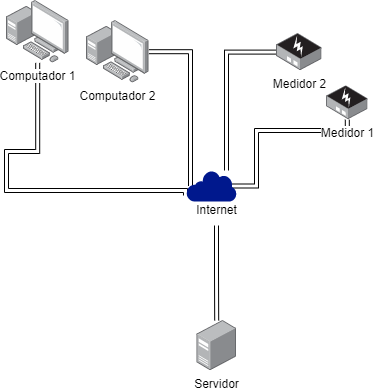

# PBL1 - MI Concorrência e Conectividade
Sistema que simula um sistema de medidores inteligêntes. Baseado na arquiterua cliente-servidor, o sistema a seguir é composto por dois clientes: medidor e interface de  usuário( não gráfica). Por fim um servidor que centralizado que processas as requisições e devolve de acordo com as solicitações por meio de uma conexação de rede. Conforme está demostrado no diagrama abaixo:



Todos os softwares do sistema foram desenvolvidos com Python 3.10.9. Lembre-se de executar os seguintes comandos abaixo para cada módulo, caso não tenha Docker:

```
pip install -r requirements.txt

python __init__.py

```

Caso esteja no Larsid talvez será necessário configurar previamente o computador, se não estiver usando o docker, execute as seguintes instruções previamente:

```
sudo apt install python3-pip

sudo apt install python3.8-venv

python3 -m venv venv

source venv/bin/activate
```

Para qualquer computador, que tenha o Docker execute as seguintes instruções para executar:

```
docker pull image_name

docker run -it image_name

```

As imagens correspondente são:

- laraesquivel/pbl1-server
- laraesquivel/pbl1-cliente
- laraesquivel/pbl1-medidor

Lembre-se de inserir corretamente os endereços de ip no cliente e medidor correspondente ao servidor. O servidor está hospedado no Portainer no Larsid09, insira: 172.16.103.9

## Interface 

Esse é um cliente para o uso de funcionários da concessionária de energia e clientes da concessionária, funciona em cima do protocolo de comunicação HTPP e se comunicará com a porta 8888 do servidor. É uma interface de terminal, o funcionário da concessionária pode fazer:
- Cadastrar cliente
- Cadastrar medidor associado

Enquanto o cliente:
- Solicitar fatura do mês
- Solicitar histórico de medições fornencendo um periodo
- Pode receber alarme de excesso de consumo

## Medidor

O medidor é o aparelho que realiza as medições num determinado periodo de tempo, lembrando que este programa é apenas um simulador, não uma representação real de um software embarcado. O medidor se comunica com o servidor por meio do protocolo UDP na porta 8080. O medidor permite:

- Enviar medições de forma automática 
- Alterar a velocidade das medições

## Servidor 

O servidor centraliza todas as requisições e trata de acordo com o que for solicitado recebendo um json empacotado. Este possui duas portas, uma porta TCP e o outra UDP, respectivamente: 8888 e a 8080. As rotas TCP são as seguintes:

- /cadCliente -> Cadastra cliente recebe por padrão:
  - id : corresponde ao identificador único do usuário, a interface por padrão envia o cpf
  - name : nome do usuário
- /cadMedidor -> Cadastra medidor de cliente associado, por padrão gera um medidor automático com id=1, um cliente pode ter mais de um medidor, os proxímos id serão a soma do id do medidor anteriormente cadastrado + 1
  - id : id do cliente responsável pelo novo medidor
- /postConsumo -> Publicar consumo via http
  - id: identificador do usuário
  - id_medidor: identificador do medidor 
  - valor: valor captado
  - timestamp: tempo em timestamp de quando o valor foi captado
- /getAlarme -> Emite alarme, o servidor não é mqtt. O método precisa ser convocado de forma agendada no cliente.
  - id: indentificador do usuário
- /getConsumoHist -> Retorna o histórico de consumo de um cliente
  - id: identificador do usuário
  - periodo: Número do periodo, por exemplo 0 para ser o periodo atual.
  - kind: tipo de periodo, deve ser uma string: D-day, M-mês, Y-ano
  
- /getFatura -> Retorna a fatura
  -id : identificador do usuário
  
  Considerações Finais:
  
  Este código cumpriu a sua função como simulador de um sistema de Iot. Possui dois tipos de clientes: Um TCP(o qual possui dois usuários: cliente da concessionária e funcionário da concessionária) e UDP que é o medidor associado ao cliente. Assim este programa conseguiu concluir com êxito:
  - Cadastrar cliente
  - Cadastrar medidor do cliente
  - Publicar medição personalizada
  - Publicar medição automática
  - Verificar fatura
  - Verficar histórico de medições 
  - Emitir um alarme de gastos 
  
  O código atual ainda precisa ser melhorado em termos de validações de dados porque os dados fornecidos não validados e nem tratados, exemplo: o cpf do cliente pode não ser um cpf real ou o usuário vai inserir um tipo não esperado pelo programa. Os dados também precisam ser salvos, uma vez que o servidor se encerra os dados são perdidos. Falta uma interface gráfica para o uso real do usuário, e um embarcado para o medidor, sistema de segurança para que o sistema deixasse de ser um simulador de um sistema. O que pode ser melhorado em proxímas versões.
